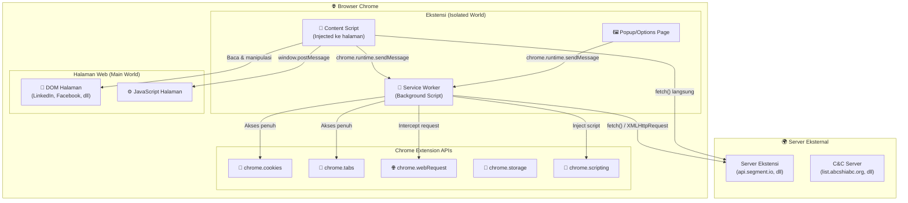
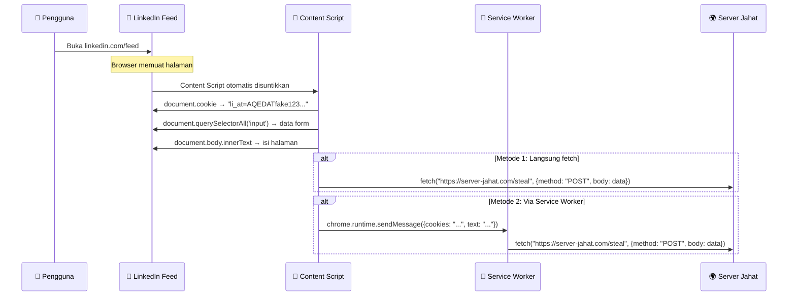
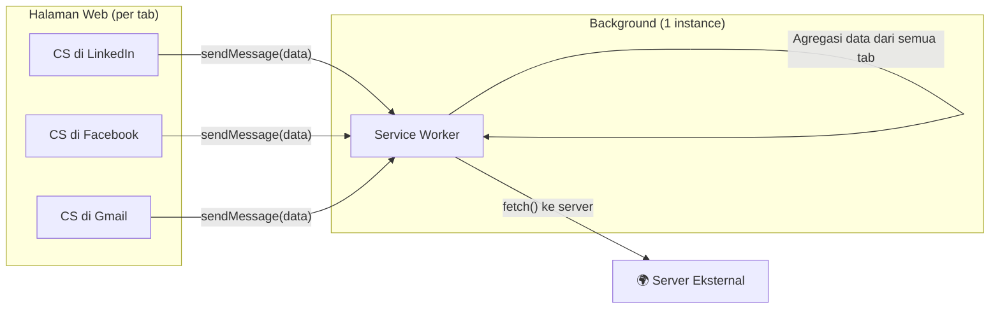
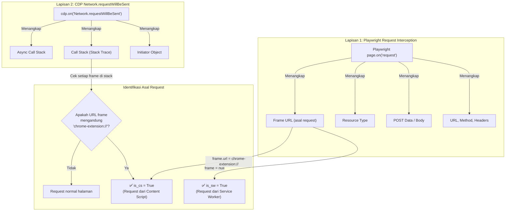
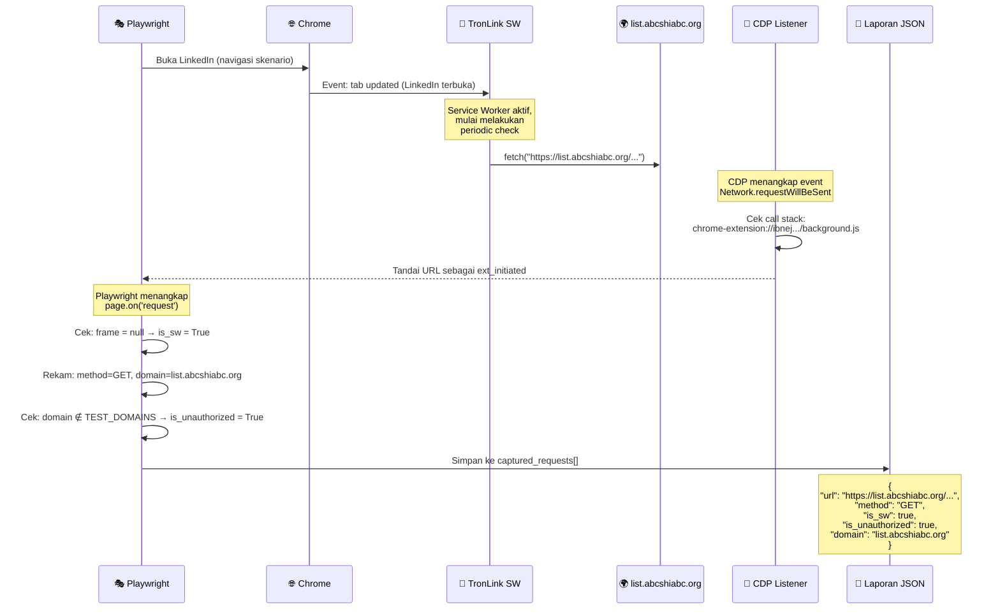

# Mekanisme Kerja Ekstensi Browser & Sistem Deteksi CDP

## 1. Arsitektur Ekstensi Browser Chrome (Manifest V3)

Sebuah ekstensi Chrome modern (Manifest V3) memiliki **3 komponen utama** yang masing-masing berjalan di lingkungan terpisah:



---

## 2. Penjelasan Setiap Komponen

### 2.1 Service Worker (Background Script) — `is_sw = True`

**Apa itu?**  
Service Worker adalah "otak" dari ekstensi. Ia berjalan di latar belakang tanpa tampilan visual, **terpisah sepenuhnya** dari halaman web manapun. Ia tidak memiliki akses langsung ke DOM halaman, tetapi memiliki akses penuh ke **semua Chrome Extension API**.

**Bagaimana ia bekerja?**
- Berjalan secara **persisten** (selama browser aktif) atau dipicu oleh *event* tertentu (alarm, message, webRequest)
- Tidak terikat pada tab atau halaman manapun — ia hidup di level browser
- Memiliki akses ke `chrome.cookies.getAll()`, `chrome.tabs.query()`, `chrome.webRequest.onBeforeRequest`, dll
- Dapat melakukan `fetch()` ke server manapun **tanpa batasan CORS** (karena ia bukan bagian dari halaman web)

**Mengapa berbahaya untuk SEE?**  
Service Worker adalah komponen paling berbahaya karena:
1. **Tidak terlihat oleh pengguna** — tidak ada indikator visual bahwa ia sedang berjalan
2. **Akses ke semua cookie browser** — termasuk cookie situs yang sedang tidak dibuka
3. **Bisa mengirim data kapan saja** — bahkan saat pengguna tidak sedang browsing
4. **Tidak terikat CORS** — bisa mengirim data ke server manapun tanpa hambatan

**Contoh nyata dari hasil pengujian:**
```
Exodus Wallet (aholpfdialjgjfhomihkjbmgjidlcdno):
  POST → api.segment.io/v1/track [Service Worker]
  Data: {"anonymousId":"1c015cf7-...", "event":"OnboardingView", 
         "properties":{"app_platform":"browser", "os_name":"win"}}
```
Di sini, Service Worker Exodus **secara diam-diam** mengirimkan data telemetri ke server analytics pihak ketiga (Segment.io) setiap kali ekstensi diaktifkan, tanpa sepengetahuan pengguna.

---

### 2.2 Content Script — `is_cs = True`

**Apa itu?**  
Content Script adalah kode JavaScript yang **disuntikkan (injected)** langsung ke dalam halaman web yang sedang dibuka pengguna. Ia berjalan di dalam "Isolated World" — sebuah sandbox khusus di mana ia dapat membaca dan memanipulasi DOM halaman, tetapi tidak dapat mengakses variabel JavaScript halaman secara langsung.

**Bagaimana ia bekerja?**
- Ditentukan oleh field `content_scripts.matches` di `manifest.json`
- Contoh: `"matches": ["http://*/*", "https://*/*"]` → disuntikkan ke **SEMUA** halaman web
- Contoh: `"matches": ["*://*.linkedin.com/*"]` → hanya disuntikkan ke LinkedIn
- Berjalan **setiap kali** pengguna membuka halaman yang cocok dengan pola `matches`
- Dapat membaca seluruh DOM (termasuk teks, form input, gambar, link)
- Dapat memodifikasi DOM (menyisipkan elemen, mengubah link, menambah script)

**Mengapa berbahaya untuk SEE?**  
Content Script adalah "mata dan tangan" dari ekstensi di dalam halaman:
1. **Bisa membaca apa yang pengguna lihat** — termasuk email, chat, password yang diketik
2. **Bisa membaca `document.cookie`** — cookie halaman yang sedang dibuka
3. **Bisa mengirim data yang dibaca ke Service Worker** via `chrome.runtime.sendMessage()`
4. **Bisa langsung melakukan `fetch()` ke server eksternal** — tanpa melalui Service Worker

**Alur exfiltration melalui Content Script:**



**Contoh nyata dari hasil pengujian:**
```
ParrotTalks (kkodiihpgodmdankclfibbiphjkfdenh):
  matches: ["http://*/*", "https://*/*", "ftp://*/*", "file://*/*"]
  
  Saat pengguna membuka LinkedIn:
    GET → www.parrottalks.com/note-ann/?manifest  [Content Script via CDP]
    GET → www.parrottalks.com/api/note/features    [Content Script via CDP]
    GET → www.parrottalks.com/note-vault/manifest.json [Content Script via CDP]
```
ParrotTalks memiliki Content Script yang disuntikkan ke **semua halaman** (`http://*/*`). Setiap kali pengguna membuka halaman apapun (termasuk LinkedIn, Facebook), Content Script tersebut **langsung menghubungi server ParrotTalks** untuk mengambil konfigurasi.

---

### 2.3 Hubungan Antara Content Script dan Service Worker



**Pola Serangan SEE Umum:**
1. Content Script **mengumpulkan data** dari setiap halaman yang dibuka (cookie, teks, form)
2. Content Script **mengirim data** ke Service Worker via `chrome.runtime.sendMessage()`
3. Service Worker **mengagregasi data** dari semua tab
4. Service Worker **mengirim data dalam batch** ke server eksternal via `fetch()`

Inilah mengapa kedua komponen ini perlu dipantau secara bersamaan — Content Script bertindak sebagai **sensor** (pengumpul data), sementara Service Worker bertindak sebagai **transmitter** (pengirim data).

---

## 3. Bagaimana CDP (Chrome DevTools Protocol) Menangkap Aktivitas

### 3.1 Apa itu CDP?

CDP (Chrome DevTools Protocol) adalah protokol komunikasi level rendah yang memungkinkan program eksternal (dalam kasus kita, Playwright) untuk **berinteraksi langsung dengan mesin internal Chrome**. Ini adalah protokol yang sama yang digunakan oleh Chrome DevTools (F12) untuk menampilkan tab Network, Console, dll.

### 3.2 Mekanisme Penangkapan di Sistem Kita

Sistem analisis dinamis kita menggunakan **2 lapisan penangkapan** yang saling melengkapi:



### 3.3 Cara Sistem Membedakan Request Ekstensi vs Request Halaman

Ini adalah bagian paling krusial dari sistem deteksi kita. Ketika browser mengirim request jaringan, kita perlu membedakan:

| Asal Request | Cara Identifikasi | Flag |
|-------------|-------------------|------|
| **Service Worker ekstensi** | Request tidak memiliki `frame` (karena SW berjalan di luar konteks halaman) | `is_sw = True` |
| **Content Script ekstensi** | CDP Call Stack mengandung URL `chrome-extension://...` | `is_cs = True` |
| **Halaman web biasa** | Frame URL adalah URL halaman normal (linkedin.com, dll) | `is_sw = False, is_cs = False` |

**Kode aktual di `sandbox_runner.py`:**

```python
# Lapisan CDP: Mendeteksi Content Script via Call Stack
def on_req_will_be_sent(event):
    initiator = event.get("initiator", {})
    stack = initiator.get("stack", {})
    
    # Telusuri seluruh call stack (termasuk async parent)
    while stack:
        for frame in stack.get("callFrames", []):
            if "chrome-extension://" in frame.get("url", ""):
                # TERTANGKAP! Request ini berasal dari Content Script
                ext_initiated_urls.add(url)
                return
        stack = stack.get("parent", {})  # Cek async parent stack

# Lapisan Playwright: Mendeteksi Service Worker
def on_request(req):
    frame = req.frame
    if frame is None:
        is_sw = True  # Tidak ada frame = Service Worker
    elif req.url in ext_initiated_urls:
        is_cs = True  # URL sudah ditandai oleh CDP sebagai dari ekstensi
    elif frame.url.startswith("chrome-extension://"):
        is_cs = True  # Frame itu sendiri adalah halaman ekstensi
```

### 3.4 Mengapa Harus 2 Lapisan?

| Lapisan | Kelebihan | Keterbatasan |
|---------|-----------|-------------|
| **Playwright** | Mudah mengakses `post_data`, headers, method | Tidak bisa melihat call stack (tidak tahu siapa yang memulai request) |
| **CDP** | Bisa melihat **seluruh call stack** termasuk async stack | Lebih sulit mengekstrak POST data |

Dengan menggabungkan keduanya, kita mendapat gambaran lengkap: **siapa** yang mengirim request (CDP) dan **apa** yang dikirim (Playwright).

---

## 4. Contoh Alur Lengkap: Dari Ekstensi Hingga Tertangkap

### Contoh: TronLink menghubungi domain DGA



---

## 5. Ringkasan: Hubungan Komponen

```
┌─────────────────────────────────────────────────────────────────┐
│                    EKSTENSI BROWSER                              │
│                                                                  │
│  ┌──────────────────┐        ┌──────────────────────┐           │
│  │  Content Script   │───────▶│   Service Worker      │          │
│  │                   │ send   │                       │          │
│  │  • Berjalan DI    │ Msg()  │  • Berjalan DI LATAR  │          │
│  │    DALAM halaman  │        │    BELAKANG browser   │          │
│  │  • Baca DOM       │        │  • Akses Chrome APIs  │          │
│  │  • Baca cookie    │        │  • Kirim data keluar  │          │
│  │  • Baca form      │        │  • Tidak terlihat     │          │
│  └────────┬─────────┘        └──────────┬───────────┘           │
│           │ fetch()                      │ fetch()                │
└───────────┼──────────────────────────────┼───────────────────────┘
            │                              │
            ▼                              ▼
┌───────────────────────────────────────────────────────────────────┐
│                 JARINGAN (Network Layer)                          │
│                                                                   │
│  ┌─────────────────────────────────────────────────────────┐     │
│  │              CDP + Playwright (Sistem Kita)              │     │
│  │                                                          │     │
│  │  CDP menangkap:          Playwright menangkap:           │     │
│  │  • Call Stack            • URL, Method, Headers          │     │
│  │  • Initiator URL         • POST Data (body)              │     │
│  │  • Async Stack Depth     • Resource Type                 │     │
│  │                          • Frame URL                     │     │
│  │                                                          │     │
│  │  Gabungan → Identifikasi: is_sw atau is_cs              │     │
│  └─────────────────────────────────────────────────────────┘     │
│                              │                                    │
│                              ▼                                    │
│                    captured_requests[]                            │
│                    (disimpan ke JSON)                             │
└───────────────────────────────────────────────────────────────────┘
```

**Kesimpulan sederhana:**
- **Content Script** = "mata" ekstensi yang melihat apa yang pengguna lihat di halaman web
- **Service Worker** = "otak" ekstensi yang memproses dan mengirim data secara diam-diam
- **CDP** = "CCTV" kita yang merekam semua aktivitas jaringan dan bisa membedakan mana request dari ekstensi, mana request normal halaman
- **Playwright** = "perekam" yang menyimpan detail lengkap setiap request (method, URL, data yang dikirim)

Kombinasi CDP + Playwright memungkinkan kita mengatakan dengan pasti: *"Ekstensi X, melalui Service Worker-nya, mengirimkan POST request berisi data Y ke domain Z, pada saat pengguna sedang membuka halaman LinkedIn."*
