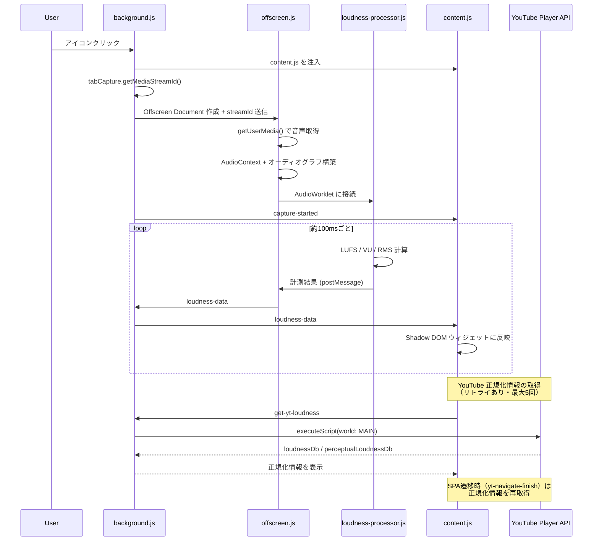
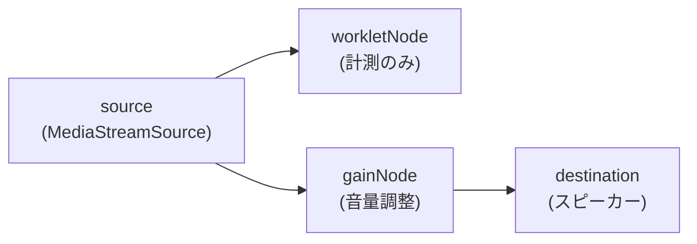

# YouTube Loudness Checker

YouTube の動画音声をリアルタイムで計測し、ラウドネス（LUFS）・VU・RMS を画面上に表示する Chrome 拡張機能です。YouTube 側のラウドネス正規化情報も検出して表示します。

## 計測項目

### LUFS (ITU-R BS.1770)

| 指標 | 窓幅 | 説明 |
|------|------|------|
| Momentary LUFS | 0.4 秒 | 瞬時音量。急な爆音やピークを捉える |
| Short-term LUFS | 3 秒 | 体感的な「今の音量」に近い平均値 |
| Integrated LUFS | 計測全体 | 開始からの全体平均。BS.1770-4 ゲーティング（絶対ゲート -70 LUFS / 相対ゲート -10 dB）で無音区間を除外 |

### Signal Level

| 指標 | 特性 | 説明 |
|------|------|------|
| VU | 300ms バリスティック | ANSI C16.5 準拠。アナログメーターの針の動きを模倣。0 VU = -20 dBFS |
| RMS (dBFS) | 0.4 秒 | 聴覚補正なしの信号レベル。LUFS との差で周波数バランスがわかる |

### YouTube Normalization

YouTube プレイヤーの内部 API からラウドネス正規化情報を取得して表示します。

| 項目 | 説明 |
|------|------|
| Original | YouTube がアップロード時に計測した推定コンテンツラウドネス（LUFS） |
| Adjustment | YouTube が再生時に適用する音量補正。ターゲット（-14 LUFS）より大きい動画は自動で下げられる |

## 使い方

1. Chrome に拡張をインストール
2. YouTube で動画を開く
3. 拡張アイコンをクリック → 画面右上にメーターが表示され計測開始
4. もう一度アイコンをクリック、またはウィジェットの × ボタンで計測停止

- ウィジェットはドラッグで自由に移動できます
- ボリュームスライダーで再生音量を調整できます（計測値には影響しません）
- YouTube 内のページ遷移（SPA）にも対応し、動画切替時に正規化情報を自動で再取得します

## アーキテクチャ

Chrome Extension Manifest V3 の制約上、Service Worker 内で `AudioContext` が使えないため、3 つのコンテキストが協調して動作します。

```mermaid
graph LR
  subgraph content["content.js(YouTubeページ)"]
    c1["メーターUI / Shadow DOM"]
    c2["音量スライダー"]
    c3["YT正規化表示"]
    c4["ドラッグ移動"]
  end

  subgraph background["background.js(Service Worker)"]
    b1["tabCapture制御"]
    b2["メッセージルーティング"]
    b3["YT API取得 (world:MAIN)"]
  end

  subgraph offscreen["offscreen.js(Offscreen Document)"]
    o1["AudioContext"]
    o2["AudioWorklet"]
    o3["音声計測 / 再生"]
    o4["デバイス変更監視"]
  end

  subgraph processor["loudness-processor.js(AudioWorklet Processor)"]
    p1["LUFSMeter"]
    p2["VUMeter"]
    p3["RMSMeter"]
  end

  content <-- "メッセージ" --> background
  background <-- "メッセージ" --> offscreen
  offscreen --- processor
```



### 処理の流れ



### オーディオグラフ（並列接続）



計測パスと再生パスを並列に接続することで、ボリュームスライダーで再生音量を変えても計測値に影響しません。音声出力デバイスの変更時は AudioContext を自動で再構築します。

## ファイル構成

```
├── manifest.json          … MV3 マニフェスト（権限・content script 定義）
├── background.js          … Service Worker（tabCapture 管理、メッセージルーティング、YT API 取得）
├── offscreen.html         … Offscreen Document の HTML シェル
├── offscreen.js           … AudioContext + オーディオグラフ管理、デバイス変更監視
├── loudness-processor.js  … AudioWorkletProcessor（LUFSMeter / VUMeter / RMSMeter）
├── content.js             … YouTube 画面上のオーバーレイ UI（Shadow DOM）
└── icons/                 … 拡張アイコン（16/48/128px）
```

## 使用している権限

| 権限 | 用途 |
|------|------|
| `tabCapture` | タブの音声ストリームを取得 |
| `offscreen` | Service Worker 外で AudioContext を使うための Offscreen Document 作成 |
| `activeTab` | アクティブタブへのアクセス |
| `scripting` | content script の動的注入、YouTube プレイヤー API へのアクセス（`world: "MAIN"`） |

## 技術的な補足

- **K-weighting フィルタ**: 48kHz / 44.1kHz のバイクアッド係数を内蔵。2 段の IIR フィルタ（Direct Form I）で実装
- **Integrated LUFS ゲーティング**: BS.1770-4 準拠の 2 段ゲート。絶対ゲート（-70 LUFS）→ 相対ゲート（平均 - 10 dB）で無音・小音量区間を除外
- **VU メーター**: 1 次 IIR ローパスフィルタで 300ms バリスティック特性を再現
- **リングバッファ**: `Float64Array` を使用し、精度を確保しつつ固定メモリで動作
- **並列オーディオグラフ**: 計測パスと再生パスを分離し、GainNode による音量調整が計測値に影響しない設計
- **デバイス変更対応**: `navigator.mediaDevices` の `devicechange` イベントを監視し、AudioContext を自動再構築
- **Shadow DOM**: YouTube の CSS と完全に分離されたウィジェットを実現。`mode: "closed"` で外部からのアクセスを遮断
- **YouTube 正規化検出**: `chrome.scripting.executeScript({ world: "MAIN" })` でページコンテキストの YouTube プレイヤー API（`getPlayerResponse().playerConfig.audioConfig`）にアクセス
- **SPA 対応**: YouTube の `yt-navigate-finish` イベントを監視し、動画切替時に正規化情報を再取得
- **無音判定**: tabCapture は停止中も微小ノイズを送出するため、-60 dB 以下を無音として扱う
